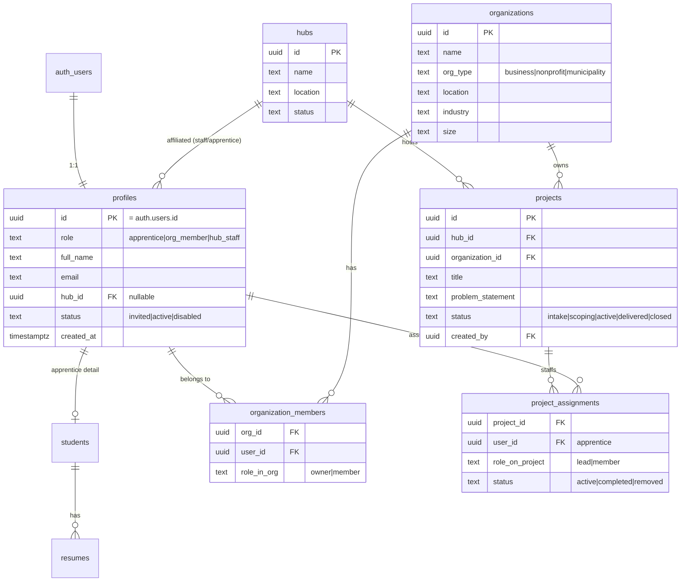

# InnovateLocal Platform — Foundation Plan

> **Scope of this document:** the *shared foundation* of the platform — auth,
> roles, the full relational data model, RLS strategy, the authenticated app
> shell, and the build sequence. User-facing slices (hub ops console, org
> portal, apprentice portal) and tier-specific features (Innovation Credits,
> partner tiers, training catalog) are **out of scope here** and layered on
> later. The data model below is designed to *anticipate* those slices so we
> don't re-migrate when they land.
>
> **Build approach:** extend this existing Next.js repo. The marketing site and
> the platform share one codebase, one Supabase project, one design system, one
> deploy.

---

## 1. The core loop (why the model looks like this)

The whole business is one workflow with modifiers on top:

```
Organization has a problem
        │
        ▼
  Hub scopes it into a Project ──── assigned to ──► an Apprentice team
        │                                                    │
        ▼                                                    ▼
  delivered as a working AI tool  ◄──────────────  built + handed off + trained
```

Three account types operate this loop. The foundation must give all three a
real identity, a role, and a place to live in the schema — even though the
*screens* that make the loop usable come in later slices.

| Role (this doc) | Who | In the loop |
|---|---|---|
| `hub_staff` | InnovateLocal team (admin) | Scopes problems, assigns teams, runs delivery. Sees everything. |
| `apprentice` | Students / recent grads | Profile + resume; assigned to project teams. |
| `org_member` | Local business / nonprofit contacts | Belongs to an organization; brings problems. |

> `partner` (Community Innovation Partners / CIP tiers) is intentionally **not**
> a foundation role — partners and credits are tier-specific and deferred. The
> model leaves room for it (see §3.7).

---

## 2. Architecture: how the platform sits inside this repo

```
app/
  (marketing)/            ← existing public site, moved into a route group
    page.tsx  join/  partner/  members/  students/  ...
  (app)/                  ← NEW: authenticated platform, own layout + auth gate
    layout.tsx            ← shell: nav, role-aware, requires a session
    page.tsx             ← role-based home (routes staff/apprentice/org to their view)
    profile/page.tsx     ← every user can view/edit their own profile
  (auth)/                 ← NEW: unauthenticated auth screens
    login/page.tsx
    auth/callback/route.ts
    auth/signout/route.ts
middleware.ts             ← NEW: refresh session + gate (app) routes
lib/
  supabase/
    client.ts             ← NEW: browser client (publishable key, @supabase/ssr)
    server.ts             ← NEW: server client (cookies, @supabase/ssr)
    middleware.ts         ← NEW: session-refresh helper used by middleware.ts
  supabase.ts             ← existing publishable-key client (forms) — keep
  supabaseAdmin.ts        ← existing service-role client — keep
  db/
    schema.ts             ← extend: mirror the new tables
    index.ts              ← unchanged (Drizzle via pooler)
  auth/
    session.ts            ← NEW: getSession()/getProfile()/requireRole() helpers
supabase/migrations/
    <ts>_platform_foundation.sql   ← NEW: all foundation DDL + RLS
```

Moving the existing pages into an `(app)`-sibling `(marketing)` route group is
cosmetic (route groups don't change URLs) but keeps the two layouts cleanly
separated. If we'd rather not touch the marketing tree yet, the authenticated
section can live under a literal `/app` segment instead — see open decision D4.

### New dependency

`@supabase/ssr` — the supported way to do cookie-based Supabase Auth in the
Next.js App Router (server components, route handlers, and middleware all read
the same session). This is the only new runtime dependency the foundation
needs.

### Which key goes where (already established in this repo, unchanged)

- **Publishable/anon key** (`NEXT_PUBLIC_SUPABASE_PUBLISHABLE_KEY`) → browser +
  SSR auth clients. Subject to RLS.
- **Service-role key** (`SUPABASE_SECRET_KEY`) → server-only admin client.
  Bypasses RLS. Used for privileged provisioning (role assignment, invites).
- **`DATABASE_URL`** (pooler, port 6543, `prepare:false`) → Drizzle for typed
  relational reads/writes.

---

## 3. Data model

DDL is authored as a Supabase migration; `lib/db/schema.ts` mirrors it by hand
(the repo's existing convention — verify with `npm run db:pull`). All new tables
get RLS **enabled and deny-by-default**, exactly like `students`/`resumes`
today.



### 3.1 `profiles` — the universal account (1:1 with `auth.users`)
The one row every authenticated user has. `id` equals `auth.users.id`. Holds the
canonical **role**, display fields, optional `hub_id` affiliation, and account
`status`. Created automatically on signup by a trigger on `auth.users`.

### 3.2 `students` — apprentice detail (already exists)
Keep it; it becomes the apprentice-specific extension of a profile. Add
`user_id uuid references auth.users` (the migration already ships a commented
template for exactly this). `resumes` is unchanged and continues to cascade.

### 3.3 `organizations` + `organization_members`
An organization is a local business/nonprofit/municipality. `org_member` users
join via the `organization_members` join table (an org can have several
contacts; a person could belong to more than one org). Seeded later by
converting `inquiries` of type `members`/`partner` — that conversion is workflow
and deferred, but the tables exist now.

### 3.4 `hubs`
The operational nodes (State College today). Projects belong to a hub; staff and
apprentices can be affiliated with one via `profiles.hub_id`. Seed one row
(State College) in the migration.

### 3.5 `projects` — the core workflow entity
The engagement that connects an organization's problem to an apprentice team
through a hub. `status` walks the loop: `intake → scoping → active → delivered →
closed`. Foundation ships the table + enum; the screens that drive the status
transitions are the hub-console slice (later).

### 3.6 `project_assignments`
Which apprentices are on which project team, and their role on it. The
many-to-many that makes "assign a team" real.

### 3.7 Room left for deferred features
- **Partners / CIP tiers / Innovation Credits:** add a `partners` table + a
  `partner` role + a credits ledger later. Nothing in the foundation blocks it.
- **`inquiries` bridge:** stays as the public intake bucket. A future job
  "promotes" an inquiry into an `organization` + invited `org_member`, or an
  `apprentice` profile. Foundation just needs the destination tables to exist —
  they now do.

---

## 4. Roles & access control

### 4.1 Where the role lives
Canonical role is `profiles.role`. For RLS we must avoid recursive lookups
(a policy on `profiles` that queries `profiles`). Two viable patterns:

- **Recommended — SECURITY DEFINER helper.** A `public.current_role()` /
  `public.is_staff()` function marked `security definer` reads `profiles`
  *bypassing RLS*, so policies on any table can call it cheaply and without
  recursion. Simple, no extra Supabase config.
- **Alternative — JWT claim via custom access token hook.** Mirror the role into
  the JWT's `app_metadata` so RLS reads `auth.jwt()` with zero table hits.
  Faster at scale, but more moving parts (an auth hook + keeping the claim in
  sync). We can adopt this later if policy volume grows.

I recommend starting with the helper-function approach (decision D2).

### 4.2 Policy shape (deny-by-default, then grant)
- `hub_staff` → full read/write across platform tables (`is_staff()` in every
  policy's `USING`/`WITH CHECK`).
- `apprentice` → read/update **own** `profiles`/`students`/`resumes`; read
  `projects` they're assigned to (via `project_assignments`).
- `org_member` → read **own** `organizations` (via `organization_members`); read
  `projects` where `organization_id` is one of theirs.
- Privileged writes that aren't owner-scoped (assigning teams, changing roles,
  provisioning accounts) go through the **service-role** server path, not anon
  policies — same model the forms use today.

### 4.3 How a user gets a role
- **Apprentice:** self-serve signup defaults to `apprentice`. (Resume/join flow
  can later create the account.)
- **org_member:** invited/created by staff (not self-serve), so an org isn't
  claimable by a stranger.
- **hub_staff:** never self-serve. Seeded via the service-role admin client /
  Supabase dashboard; flipping someone to staff is an explicit privileged action.

---

## 5. Auth flows (foundation)

- **Method:** passwordless **magic link** to start — no password storage, no
  reset flow, fastest to ship. Email/password and OAuth can be added later
  without rework (decision D3).
- **Login** (`/login`) → enter email → Supabase sends magic link →
- **Callback** (`/auth/callback`) → exchanges the code for a session cookie →
  redirects to `(app)` home.
- **Home** (`/(app)/page.tsx`) → reads the profile role and renders the matching
  minimal home (staff / apprentice / org). For the foundation these are simple
  placeholder shells — the point is that the gate, session, and role routing
  work end to end.
- **Signout** (`/auth/signout`) → clears the session.
- **`middleware.ts`** → refreshes the Supabase session on every request and
  redirects unauthenticated hits on `(app)/*` to `/login`.

A `lib/auth/session.ts` exposes `getSession()`, `getProfile()`, and
`requireRole(...roles)` so server components and route handlers gate access in
one line.

---

## 6. Build sequence

Each phase is independently reviewable and leaves the app in a working state.

**Phase 0 — Plumbing.** Add `@supabase/ssr`. Create the `lib/supabase/{client,server,middleware}.ts` helpers and `middleware.ts`. Confirm env vars (`NEXT_PUBLIC_SUPABASE_URL`, `NEXT_PUBLIC_SUPABASE_PUBLISHABLE_KEY`, `SUPABASE_SECRET_KEY`, `DATABASE_URL`) are present in `.env` and the deploy environment.
*Done when:* a server component can read "no session" without error.

**Phase 1 — Schema + RLS.** Write `supabase/migrations/<ts>_platform_foundation.sql`: `profiles` (+ `auth.users` trigger), `organizations`, `organization_members`, `hubs` (seed State College), `projects`, `project_assignments`; add `user_id` to `students`/`resumes`; the `is_staff()`/`current_role()` helpers; RLS enabled + owner-scoped policies. Mirror everything into `lib/db/schema.ts`; verify with `npm run db:pull`.
*Done when:* migration applies cleanly and `db:pull` shows no drift.

**Phase 2 — Auth.** `(auth)` route group: `/login`, `/auth/callback`, `/auth/signout`. Wire `middleware.ts` to gate `(app)/*`.
*Done when:* a magic link logs you in, lands you in `(app)`, and signout returns you to `/login`.

**Phase 3 — App shell + role routing.** `(app)/layout.tsx` (authenticated shell using the existing design system), `(app)/page.tsx` (role-based home), `(app)/profile` (view/edit own profile). `lib/auth/session.ts` helpers.
*Done when:* each of the three roles sees its own home and can edit its profile; cross-role access is blocked.

**Phase 4 — Provisioning.** Default-`apprentice` profile on signup (trigger); a minimal staff-only action to set a user's role and to invite an `org_member` into an organization; seed the first `hub_staff`.
*Done when:* staff can create an org + invite a contact, and promote a user to staff — all via service-role paths, never anon.

**Phase 5 — Bridge existing data.** Backfill/connect `students` + `resumes` to `auth.users` via `user_id`; enable the owner-scoped policies that the original migration left commented.
*Done when:* a logged-in apprentice sees their own resume and nobody else's.

> Phases 6+ (out of scope here): hub ops console, org portal, apprentice portal,
> then tier/credit features.

---

## 7. Verification strategy

- `npm run typecheck` + `npm run lint` green after each phase.
- `npm run db:pull` shows zero drift between the live DB and `lib/db/schema.ts`.
- Manual auth walkthrough per role (login → home → profile → blocked
  cross-access → signout).
- RLS spot-checks: with an apprentice's anon session, attempts to read another
  user's `profiles`/`resumes` and an unassigned `project` all return empty.

---

## 8. Open decisions (recommendations in **bold**)

- **D1 — Role set for v1:** `apprentice`, `org_member`, `hub_staff`. **Ship these
  three; defer `partner`.**
- **D2 — Role-in-RLS mechanism:** **SECURITY DEFINER helper function** now; JWT
  claim later if needed.
- **D3 — Auth method:** **Magic link** first; add password/OAuth later.
- **D4 — Marketing routes:** **Introduce `(marketing)` + `(app)` route groups**
  (URLs unchanged), or keep marketing as-is and nest the platform under a literal
  `/app` segment. Low stakes; pick during Phase 0.
- **D5 — `students` table:** keep as the apprentice-detail extension of
  `profiles` (recommended) vs. fold its fields into `profiles`. **Keep separate**
  — resumes already FK to it.

---

## 9. Build status

Decisions locked: D1 three roles · D2 SECURITY DEFINER `is_staff()` · D3 magic
link · **D4 → literal `/dashboard` segment, marketing tree untouched** · D5 keep
`students` separate. Statuses modeled as `text` + `CHECK` (not pg enums).

**Done (Phases 0–3) — typechecks + production build green:**
- Phase 0 — `@supabase/ssr` added; `lib/supabase/{client,server,middleware}.ts`;
  root `middleware.ts` (session refresh + `/dashboard` gate).
- Phase 1 — `supabase/migrations/20260625120000_platform_foundation.sql`
  (profiles, organizations, organization_members, hubs, projects,
  project_assignments; `students.user_id`; RLS + policies; signup→profile
  trigger; privileged-field guard). Mirrored in `lib/db/schema.ts`.
- Phase 2 — `/login` (magic link), `/auth/callback`, `/auth/signout`.
- Phase 3 — `lib/auth/session.ts` (`getUser`/`getProfile`/`requireUser`/
  `requireProfile`/`requireRole`); `app/dashboard` layout + role-routed home +
  profile view/edit; reusable `components/platform/*` shell.

**Remaining:**
- Phase 4 — provisioning UI: staff-only role assignment + org/member invites
  (signup→default-apprentice already works via trigger).
- Phase 5 — bridge `students`/`resumes` to accounts (owner-scoped RLS +
  Storage policy matching the `{student.id}/…` path scheme).

### Bring it live
- **Migration: APPLIED ✅** — `20260625120000_platform_foundation.sql` is live in
  the database and recorded in `supabase_migrations.schema_migrations`. Verified:
  10 public tables, State College hub seeded, 14 RLS policies, signup trigger +
  helper functions present. See `docs/database-migrations.md` for how it was
  applied and the migration-history divergence found along the way.
- **Supabase CLI installed** and configured (`supabase/config.toml`, project ref
  set). The earlier migration-history divergence (8 remote migrations missing
  from the repo) has been **reconciled** — the files were recovered from the
  database's own `statements` history and `students_resumes` was recorded;
  `supabase migration list` shows Local == Remote and `db push` is clean. It's
  the normal flow now. See `docs/database-migrations.md`.

Two manual one-time steps remain (remote dashboard settings the CLI can't push):
1. **Auth redirect URLs** — Supabase → Authentication → URL Configuration: add
   `http://localhost:8080/auth/callback` (dev) and
   `https://innovatelocal.ai/auth/callback` (prod); set Site URL. Magic link is
   on by default.
2. **Seed the first staff** — sign in once at `/login` (creates an apprentice
   profile), then:
   `update public.profiles set role = 'hub_staff' where email = 'you@example.com';`
   Then `/login` → magic link → `/dashboard` works end to end.
```
